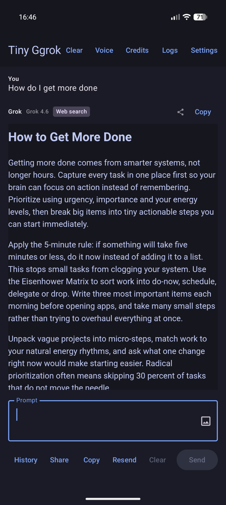

# Tiny Grok - Android Client

A lightweight native Android app for chatting with xAI's Grok models.

<p align="center">
  
</p>

## Features

- Secure API key entry and storage in Settings
- **Credits & usage** screen (chat top bar **Credits**): live prepaid API balance, postpaid limits, model rate quotas via Management API; SuperGrok plan reference (consumer quotas are not exposed by API)
- Three themes: Light, Dark, Tokyo Night
- Chat models: **Grok 4.6** (default) or **Grok 4.5** (backup) — only these two, selectable in Settings; 4.5 is used automatically if 4.6 is unavailable
- Uses xAI Agent Tools / Responses API (`https://api.x.ai/v1/responses`)
- **Live web search**: when Grok is unsure or a question depends on recent/factual information, it automatically uses the `web_search` tool instead of guessing. Source links are appended to answers (tap to open, long-press to copy)
- **UK transit lookups**: prefers official National Rail / TOC sites for live times and disruptions (see [UK transit web sources](#uk-transit-web-sources)); open web for everything else
- **GPS location** (on by default; optional — turn off in Settings): so you can ask things like *“find me transport from my current location to X”* without naming a station. Approximate coordinates/place are attached to the prompt when permission is granted; the model uses them with web search (National Rail, Thameslink, TfL, etc.) to plan from nearest stations/stops. Not required for general chat
- Clean Jetpack Compose UI with MVVM architecture
- Chat with message history (in-memory for now) plus response history screen
- **Share to Tiny Ggrok**: from any app, share text, links, or images into the chat prompt (also in the text-selection menu as **Ask Tiny Ggrok**). Share a Grok reply or the whole conversation back out via the system share sheet
- Pinch-to-zoom on the whole chat screen
- Image attach on prompts
- Voice translator (optional, Grok Voice API)
- Debug mode with API request/response logs
- Show estimated cost per query (optional)
- **Streaming** Responses API (SSE) for chat + `web_search`, with HTTP/2 pings, so long reasoning/search does not hit “Timed out contacting api.x.ai”
- **Network resilience** (see [Network resilience](#network-resilience)): DNS-over-HTTPS fallback when the network's resolver can't find `api.x.ai`, IPv4-first connects, short connect timeout with up to 3 attempts, and an instant “offline” message instead of a long stall
- **Faster sends**: the TLS connection to `api.x.ai` is opened when the app starts / you begin typing, GPS waits at most 3 s at send time (falls back to the cached fix), and chat history sent as context is capped by size
- **Document scanner, no Google Play services**: tap the scan icon in the top bar, photograph a page with your phone's own camera app, and the page is found, squared up and ready to attach or share. The page is located on the phone when it can be (instantly, offline) and by Grok's vision when it cannot; the corners are then tightened onto the real paper edges and the page is flattened with Android's built-in perspective transform. Corners stay draggable, and **Snap** re-aligns them to the nearest paper edge. See [Document scanner](#document-scanner)
- **Never stuck waiting**: **Stop** cancels a reply that is taking too long, typing while a reply arrives queues your next prompt (it sends itself when the current one lands), and **Clear** also stops anything in flight
- **Live replies**: the answer streams onto the screen as Grok writes it, with a **Searching the web** status while it looks things up, instead of a motionless indicator until the whole reply lands
- **Reasoning effort tuned per question**: ordinary questions use `low` effort (the API default is `high`, which spends tens of seconds thinking before the first token); rail/transit questions keep `high`. Agentic tool turns are capped so a vague question cannot loop through searches indefinitely

## Document scanner

Built to work without Google Play services, ML Kit or OpenCV. Tap the scan icon in the top bar and pick a source:

- **Take a photo**: quick capture through a camera intent. Convenient, but on some phones, Pixels among them, quick capture skips the multi-frame processing the full camera app applies. In a dim room that means one noisy, heavily smoothed frame, and small print comes out soft however it is processed afterwards. Use good light or turn the flash on.
- **Choose a photo**: align a picture you already have. Shooting with your full camera app first and choosing that photo gives the sharpest scans by a wide margin.

This was established the hard way: a user's scan was mush while their camera-app photo of the same page was crisp, and feeding that photo through the identical pipeline produced a crisp scan. The processing was never the limit; the input was.

The scanner shows the facts it is working with, for example `Photo 4080 × 3072 · page about 2100 × 2900 px`, so you can see at a glance whether to move closer. For a sharp scan, fill the frame with the page: detail that was never captured cannot be recovered. If a page ever has to be produced from the reduced preview instead of the original photo, the scanner says so rather than failing quietly, and with Debug mode on each save is recorded in the log with its size and how it was produced.

1. **Capture** uses a plain camera intent, so any camera app works (including on de-Googled phones) and Tiny Ggrok needs no camera permission.
2. **Find the page, on the phone first.** A light page on a darker surface, or the reverse, is located in milliseconds with no network: shrink and median-filter the photo until texture and print drop out, split it into two brightness classes, and reduce a region's outline to four corners. Which class is the page is deliberately not decided up front. Every rule tried for that failed somewhere: "the page is whatever the photo's border is not made of" breaks the moment a page fills the frame and runs off a side, which is exactly what a sharp scan needs, and "the page is whatever is in the middle" turns a bare carpet into a full-frame page. So both readings are proposed and the edge check decides, because only a real page is bounded by straight paper edges. Every side must be either confirmed on a real paper edge or lie along the photo's border where the page runs out of frame, with at least one real side. That rejects a tidy-looking shape produced by uneven lighting, and a bare surface.

   **Repair, don't reject.** Anything bright touching the page, such as a hand holding it, a cloth or a second sheet, merges with it in the brightness split, and the proposed side there runs through the clutter instead of along the paper. Rather than discard an outline that is right on three sides, the unconfirmed side is searched for: a trial line is walked inward from where it was proposed, held parallel to the confirmed opposite side, until a real paper edge is confirmed.

   **Pages that fill the frame.** A side that is out of frame is reconstructed rather than left on the photo's border. The border is not a paper edge: used as one, it makes the warp straighten the top of the page while leaving the bottom tilted. A sheet has parallel opposite sides, so the missing side is drawn parallel to its visible opposite (or square to a visible neighbour), far enough out to keep everything the camera saw. The resulting corners may sit slightly outside the photo; the editor shows and grabs them at the border.
3. **Ask Grok when that is not confident**, for example white paper on white marble, or a cluttered scene. A reduced copy of the photo (about 1024 px) goes to Grok, which returns the four corners. **Ask Grok** in the scanner forces this.
4. **Make it straight.** Whichever route found the page, it is only accurate to a percent or so, which shows up as a tilted scan. So the app walks along each rough edge, works out where the paper begins at dozens of points, fits a straight line through them, and uses the line intersections as the corners.
5. **Flatten, from the original capture.** Android's own four-point perspective transform maps the page to an upright rectangle. The editor works on a reduced preview, but the page is cut from the photo *as stored*, at up to 3508 px on the long side (A4 at 300 dpi) and never enlarged. Only the page's bounding box is decoded, so a 50-megapixel capture costs no more memory than the page needs. Cutting the page out of the preview instead, as earlier versions did, kept under half the detail whenever the page did not fill the frame.

6. **Enhance.** A flattened photo is geometrically right and still reads as soft, for reasons that have nothing to do with pixel count: the paper is grey-beige and unevenly lit, and the camera's own smoothing never lets a thin stroke reach black (on one real scan the ink measured 0.55 against paper at 0.86). So the page is cleaned up the way dedicated scanners do it: the bare paper's colour is estimated everywhere and divided out, which removes shading and colour cast together and makes the paper white; brightness is sharpened and its levels set so ink goes to black; and colour is *smoothed* rather than sharpened, which averages the camera's colour noise off the letters while a pen stroke keeps its blue. The ink level is judged from the grey print itself, not from the darkest pixels, so a logo or stamp with true blacks does not leave the text beside it grey. Large dark or coloured areas are recognised as not-paper and left even. **Enhance: on/off** in the scanner turns it off for pages that are mostly photographs.

7. **Clean edges.** The outline is fitted to the middle of the paper's slightly blurred edge, so cutting exactly on it keeps half of that edge and a sliver of desk: measured on a real scan, a dark rim three to four pixels thick on every side. The page is therefore cut 0.4% of its shorter side inside the outline, by moving each side parallel to itself so that the same few pixels come off every edge however tilted. A uniform trim cannot remove a *wedge*, though, which is what a straight outline leaves against a slightly curled edge or a plastic sleeve showing just beyond it (the same scan was still 10% dark ten pixels in on one side), and trimming far enough to do so would cost real margin on every scan. So what remains is whitened instead, under a deliberately narrow rule: working inward from the very edge of the scan, only while pixels are darker than paper, and only within a band of 1.2%. Print, which sits inside the margins, is never reached; content that really runs to the edge loses at most the band's depth; and a side that is dark right through the band along much of its length is the document's own (a full-bleed photo, a cover) and is left alone. Whitening applies only to enhanced pages, where paper is white.

"Where the paper begins" is judged by comparing the **median** brightness of a region just inside a candidate position with one just outside it. That choice was earned the hard way. Looking for the sharpest local step drifted onto carpet speckle. Comparing region *means* survived texture but cropped a scan to its block of text on white marble, because print drags a mean down. A median ignores anything covering less than half of a region, which is true of print, plank seams, marble veins and carpet pile alike. The median identifies the right boundary; a sharp local measure then pinpoints it; and the line is refitted after dropping points that disagree, so a finger on the page or a dog-eared corner does not tilt the edge it interrupts.

Tested on synthetic dark wood, pale wood, white marble, dark granite, concrete and carpet, in even light and lit from one side, each with its most misleading feature (seams, grain, veins, speckle, contact shadow). All land within 0.3% of the frame.

**You see the aligned page, not just an outline.** When the page is found automatically the scanner goes straight to the result: the page cut out, straightened and enhanced, with pinch to zoom so you can check the small print. **Adjust corners** goes back to the outline editor, where **Align** produces the result again. Earlier versions only ever showed the original tilted photo with an outline drawn on it and did the straightening invisibly at the moment of sharing, which looked exactly as if the borders were found and then never aligned.

Once the page is aligned there are two places it can go. **To prompt** attaches a copy capped at 2048 px (ample for Grok to read small print, and a sensible upload) to your message. **Share** sends the full-detail straightened JPEG through Android's share sheet to any app that accepts an image, such as Signal, Telegram or your email app (the file name becomes the email subject). Share leaves the scanner open, so one scan can go to another app and into the prompt without scanning twice.

In the outline editor you can drag any corner, tap **Snap** to pull the current corners onto the nearest paper edges, or **Ask Grok**. **Rotate** is available in both views and turns the photo a quarter turn: a phone held flat over a page cannot tell portrait from landscape, so captures often arrive sideways.

Privacy and cost: most scans never leave the phone until you send them. Only when Grok is asked does one reduced photo go to xAI, billed like any small image prompt.

## Network resilience

“Can't reach api.x.ai” on Android is almost always DNS or a dead route, not xAI being down. The app now handles the common cases itself:

| Failure | What the app does |
| --- | --- |
| System DNS returns nothing (carrier/hotel Wi-Fi resolver, Private DNS misconfigured, VPN hijacking port 53) | Retries the lookup over **DNS-over-HTTPS** (Cloudflare `1.1.1.1`, then Google `8.8.8.8`, bootstrapped by IP so they work without port-53 DNS). If both fail, reuses the last address set that worked in this session |
| IPv6 route advertised but blackholed (common on mobile data) | Resolved addresses are ordered **IPv4 first**; connect timeout is 12 s instead of 60 s so a dead address is skipped quickly |
| Connect/TLS reset, HTTP/2 stream reset before any data, `408/429/5xx/529` | Up to **3 attempts** with 0.5 s → 1.5 s back-off (honours `Retry-After` up to 10 s). A reply that already started streaming is never retried, so nothing is double-billed |
| No active network | Fails immediately with “No internet connection” — no 60 s hang |
| Model id rejected | Falls back from Grok 4.6 to Grok 4.5 (unchanged) |

Turn on **Debug mode** in Settings to see each retry (`RETRY 2/3 in 500ms …`) and the reason in the log screen.

If it still fails: toggle Wi-Fi ↔ mobile data, check **Settings → Network → Private DNS** on the phone, or disable any VPN/ad-blocker that filters DNS.

## UK transit web sources

When answering rail and transit questions, the app steers `web_search` toward these official sources (implemented in chat instructions). Links are preferred over guessing times or disruptions.

### Why GPS is used

Location is **for journey-style questions that start from “here”**, not for tracking or ads. Typical use:

- *“Find me transport from my current location to King’s Cross”*
- *“Next trains from nearest station to Brighton”*
- *“How do I get from here to the airport?”*

With **Use GPS location** enabled (default) and Android location permission granted, the app adds an approximate position to the model instructions. Combined with the sources below, Grok can resolve nearby stations/stops and search live times. Disable the setting (or deny permission) anytime — chat still works; you just name the origin yourself.

**Accuracy notes:** location uses **platform GPS only** for place naming (no Google Play Services). Strategy is **cache with timeout** (not continuous tracking): optional one-shot warm lookup at app open, then reuse for the configured TTL (**Settings → GPS cache timeout**, default **10 minutes**) without touching the GPS chip; after TTL expires the next send does one fresh session and stops again. A town/postcode is reverse-geocoded only from a GPS fix ≤50 m.

### Why live answers use National Rail (and why they sometimes didn’t)

The app does **not** call National Rail’s APIs directly. It uses xAI’s server-side **`web_search`** tool: the model chooses search queries, xAI runs them, and citations come back.

Earlier builds only said “prefer official sites.” That is a soft hint — Grok could still answer from memory, or search random blogs, and never hit **www.nationalrail.co.uk** / **realtime.nationalrail.co.uk**.

Current behaviour for rail/transit enquiries:

1. Detect train/journey-style prompts (e.g. trains, departures, “from here to…”, station names).
2. **Require** `web_search` before inventing times.
3. **Require first searches** to use `site:nationalrail.co.uk` / `site:realtime.nationalrail.co.uk` (journey planner / live departures).
4. Then allow operator sites (Thameslink, TfL, etc.) and cite URLs.

Limitations (inherent to agent web search, not a local bug):

- Live boards are often **JavaScript-heavy**; the tool may get search snippets or planner pages rather than a perfect real-time board scrape.
- The model still executes the tool on xAI’s side — if search returns weak results, the app will say so and should still link National Rail.
- Turn on **Debug mode** in Settings to see whether `web_search` ran and which citation URLs came back.

### Hubs

| Source | URL |
| --- | --- |
| National Rail | https://www.nationalrail.co.uk |
| Live departure boards | https://realtime.nationalrail.co.uk |
| Network Rail (engineering / line status) | https://www.networkrail.co.uk |

### St Albans and nearby (Herts / Midland Main Line OHLE / Abbey Line)

| Operator / service | Covers | URL |
| --- | --- | --- |
| **Thameslink** | St Albans City, Luton, Bedford, St Pancras, Blackfriars, through-London Thameslink | https://www.thameslinkrailway.com |
| **London Northwestern Railway** | St Albans Abbey, Abbey Line ↔ Watford Junction | https://www.londonnorthwesternrailway.co.uk |
| **Great Northern** | Nearby ECML / Herts (e.g. Welwyn, Hatfield, Hertford, Stevenage) | https://www.greatnorthernrail.com |
| **East Midlands Railway** | Midland Main Line long-distance past the area | https://www.eastmidlandsrailway.co.uk |
| **Intalink** | Herts buses / Abbey ↔ City interchange | https://www.intalink.org.uk |

### London

| Source | Covers | URL |
| --- | --- | --- |
| Transport for London (TfL) | Tube, Overground, Elizabeth line, DLR, buses, trams, status | https://tfl.gov.uk |
| Citymapper | Journey planning / status | https://citymapper.com |

### Other major UK operators

| Operator | URL |
| --- | --- |
| Greater Anglia | https://www.greateranglia.co.uk |
| Southeastern | https://www.southeasternrailway.co.uk |
| Southern | https://www.southernrailway.com |
| Gatwick Express | https://www.gatwickexpress.com |
| South Western Railway | https://www.southwesternrailway.com |
| c2c | https://www.c2c-online.co.uk |
| Chiltern Railways | https://www.chilternrailways.co.uk |
| Great Western Railway | https://www.gwr.com |
| Avanti West Coast | https://www.avantiwestcoast.co.uk |
| LNER | https://www.lner.co.uk |
| CrossCountry | https://www.crosscountrytrains.co.uk |
| TransPennine Express | https://www.tpexpress.co.uk |
| Northern | https://www.northernrailway.co.uk |
| West Midlands Railway | https://www.westmidlandsrailway.co.uk |
| ScotRail | https://www.scotrail.co.uk |
| Transport for Wales | https://tfw.wales |
| Hull Trains (open access) | https://www.hulltrains.co.uk |
| Grand Central (open access) | https://www.grandcentralrail.com |
| Lumo (open access) | https://www.lumo.co.uk |
| Caledonian Sleeper | https://www.sleeper.scot |

Non-UK transit uses the best official operator site or general web search.

## Supported Android versions

| | |
| --- | --- |
| **Minimum** | Android 7.0 (API **24**) |
| **Target** | Android 15 (API **35**) |
| **Compile SDK** | 35 |

Devices and emulators on API 24 and above are supported. Location features need the usual runtime permission (optional; the app works without it).

## Requirements

- Android Studio or Gradle
- Android SDK 24+ (device or emulator)
- xAI **API key** with prepaid **API credits** from [console.x.ai](https://console.x.ai/)

### SuperGrok vs API credits (common confusion)

**Tiny Grok is not the official Grok app.** It talks to `https://api.x.ai` with the API key you paste in Settings.

| Product | Where | What it pays for |
| --- | --- | --- |
| **SuperGrok / SuperGrok Heavy** | grok.com / X apps | Consumer chat limits on those apps |
| **xAI API credits** | [console.x.ai → Billing](https://console.x.ai/team/default/billing) | Every request this app makes (text, images, web search, voice, etc.) |

A SuperGrok Heavy subscription **does not** fund this app. If you see “out of credits” after attaching photos, top up **API** credits (or enable auto top-up) on the console billing page. Image prompts cost more tokens than text-only ones, so a low balance often fails first when you attach photos.

## Building and Running

### Build the APK
```bash
./build.sh
```

### Build and Run in Emulator
```bash
./build.sh --emulate
```
This will build the debug APK, start the emulator (assumes `Pixel_4_API_34` AVD exists), install and launch the app.

Note: If `./gradlew` is missing, the script falls back to `gradle` command. Run `gradle wrapper` first if needed to generate the wrapper.

## Setup
1. Open in Android Studio
2. Sync Gradle
3. In Settings screen, enter your xAI API key (it will be securely stored)
4. Select theme
5. Start chatting!

### Credits & usage (optional)

To show live **API prepaid balance** and rate quotas:

1. In [console.x.ai](https://console.x.ai) → **Settings → Management Keys**, create a management key (separate from the chat API key).
2. Paste it under **Settings → API credits / Management** (Team ID is optional; the app auto-detects it).
3. Open **Credits** on the chat top bar (or **Credits & usage** in Settings) and tap **Refresh**.

**SuperGrok Heavy** utilisation cannot be read programmatically — mark your consumer plan on that screen for reference, and check remaining consumer limits in the official Grok app / [grok.com](https://grok.com).

## Architecture
Follows the plan in PLAN.md: Hilt DI, Retrofit for API, DataStore for settings, Compose for UI.

## License
MIT - For personal/educational use.

## Notes
- Package renamed from com.aicoder to com.tinygrok.client
- API key never logged or exposed
- Tokyo Night theme uses authentic colors from the popular VSCode theme
